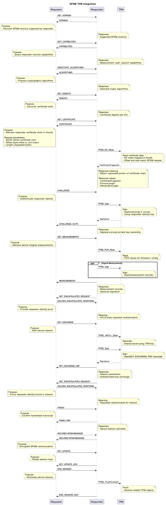

# TPM Support

## Overview

This implementation enables a Trusted Platform Module (TPM) to serve as the **Root of Trust** for SPDM flows by:
- Storing device private keys securely
- Performing cryptographic signing operations
- Providing certificates and measurement data

Testing is performed using a **software TPM (`swtpm`)**, enabling full validation without requiring physical TPM hardware.

---

## Supported SPDM Flows

- GET_CERTIFICATE  
- CHALLENGE_AUTH  
- GET_MEASUREMENTS  
- KEY_EXCHANGE  



---

## Implementation

TPM-backed functionality is implemented in `libspdm` under:

```
os_stub/spdm_device_secret_lib_tpm/
```

### Components

- `read_pub_cert.c` – Retrieves certificates from TPM NV storage  
- `chal.c` – Performs TPM-based challenge signing  
- `meas.c` – Provides TPM-backed measurements  
- `sign.c` – Performs signing using TPM-resident keys  

---

Optional:

```
# For Debian/Ubuntu
export OPENSSL_MODULES=/usr/lib/$(uname -m)-linux-gnu/ssl-modules

# For RHL/Fedora
export OPENSSL_MODULES=/usr/lib64/ossl-modules

# For ArchLinux
export OPENSSL_MODULES=/usr/lib/ossl-modules
```

---

## TPM Setup

**Do not run this script with root permissions**

```
cd build/bin
../../scripts/setup-tpm.sh --cleanup --start-swtpm
```

### TCTI Configuration

```
export TPM2TOOLS_TCTI="swtpm:port=2321"
export TPM2OPENSSL_TCTI="swtpm:port=2321"
```

---

## TPM Provisioned Objects

### Persistent Handles

| Name     | Handle     |
|----------|-----------|
| ROOT_CTX | 0x81000000 |
| ROOT_KEY | 0x81000001 |
| REQU_CTX | 0x81000010 |
| REQU_KEY | 0x81000011 |
| RESP_CTX | 0x81000020 |
| RESP_KEY | 0x81000021 |

---

### NV Indices

| Name              | Index       |
|-------------------|------------|
| ROOT_CERT         | 0x01500000 |
| REQU_CERT         | 0x01500010 |
| RESP_CERT         | 0x01500020 |
| REQU_CERT_CHAIN   | 0x01500011 |
| RESP_CERT_CHAIN   | 0x01500021 |

---

## Running the Responder

```
./spdm_responder_emu
```

---

## Validation Procedure

### GET_CERTIFICATE
Retrieves certificates from TPM NV storage

### CHALLENGE_AUTH
TPM signs challenge using private key

### GET_MEASUREMENTS
Returns TPM-backed measurements

### KEY_EXCHANGE
TPM signs key exchange messages

---

## Security Considerations

- Private keys never leave TPM  
- All signing operations are TPM-backed  
- Certificates stored in TPM NV memory  

---
